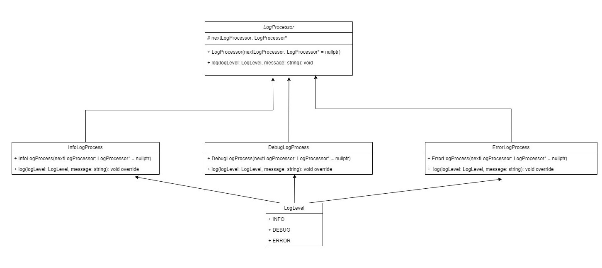

# Design Logger: A Simple Logging Framework in C++

This C++ program demonstrates a simple logging framework that processes log messages based on their severity level. The program utilizes a `chain of responsibility pattern1`, where different log processors handle messages of specific severities.

## Table of Contents
- [Classes Overview](#classes-overview)
- [How It Works](#how-it-works)
- [UML Diagram](#uml-diagram)
- [Installation and Usage](#installation-and-usage)
- [Contributing](#contributing)
- [Tests](#tests)
- [License](#license)

## Classes Overview

### `LogLevel` Enum

An enumeration class representing different log levels: INFO, DEBUG, and ERROR.

### `LogProcessor` Class

An abstract class representing the base log processor. It contains a pointer to the next log processor in the chain and a virtual function `log` that is overridden by derived classes.

### `InfoLogProcess`, `DebugLogProcess`, `ErrorLogProcess` Classes

Derived classes from `LogProcessor` that handle INFO, DEBUG, and ERROR log levels, respectively. Each class overrides the `log` function to process messages of the specified severity level.

## How It Works

1. The program creates a chain of log processors where each processor is responsible for handling a specific log level.
2. When a log message is generated, it is passed through the chain of log processors.
3. Each log processor decides whether it can handle the message based on its severity level. If it can handle it, the message is processed; otherwise, it is passed to the next log processor in the chain.

## UML Diagram



**Note:** The UML diagram illustrating the class relationships is attached. Please refer to the provided diagram for a visual representation of the class structure.

## Installation and Usage

Detailed instructions on how to install, setup, and use the project. Include code examples here.

### Windows

```bash
mingw32-make
./DesignLogger
```

### Linux

```bash
make
./DesignLogger
```

Ensure that you have the necessary build tools installed on your system, and the Makefile is present in the same directory as the source code.

## Contributing

If you're interested in contributing to this project, first, thank you! Second, please read our contributing guidelines before getting started.

<!-- ## Tests

Explain how to run the automated tests for this system. -->

## License

This project is licensed under the [MIT License](LICENSE).

Feel free to explore, modify, and enhance the logging framework as needed. Happy coding! 🚀
